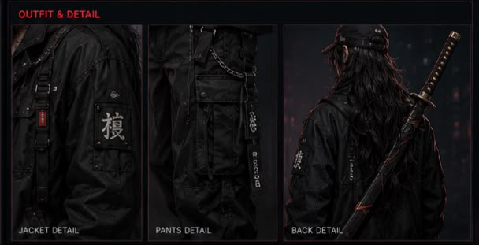
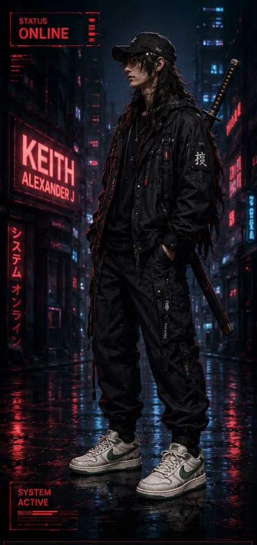
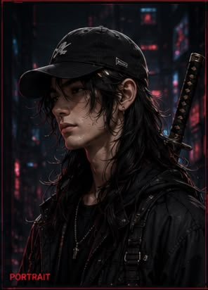
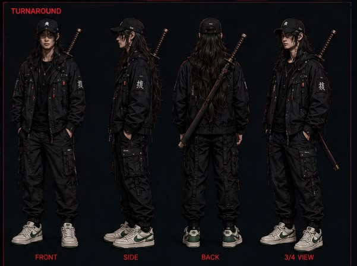

# CYBERPUNK PORTFOLIO

<div align="center">


<br><br>

<p><strong>A PLAYABLE PORTFOLIO EXPERIENCE BUILT WITH PLAYCANVAS</strong></p>

<p>
BIOTECHNOLOGY • GAMING • CHARACTER DESIGN • UI/UX • INTERACTIVE EXPERIENCE
</p>

</div>

---

## ABOUT THE PROJECT

I turned my portfolio into a small cyberpunk game. Start the game, explore my character, find my biography, skills, biotechnology projects, and proposals. Instead of opening another normal portfolio website, you get a short interactive experience where you explore and discover my work through a gaming interface.

The experience takes around **1–3 minutes**.

Instead of simply scrolling through a traditional portfolio, visitors enter a small interactive environment, meet my character, discover my background, explore my skills and biotechnology work, and eventually reach the contact stage.

The portfolio itself becomes part of the project.

---

# THE GAME JOURNEY

<div align="center">

<strong>START GAME</strong>
<br>↓<br>
<strong>MEET KAT</strong>
<br>↓<br>
<strong>BIOGRAPHY</strong>
<br>↓<br>
<strong>SKILLS</strong>
<br>↓<br>
<strong>BIOTECHNOLOGY</strong>
<br>↓<br>
<strong>PROJECTS</strong>
<br>↓<br>
<strong>PROPOSALS</strong>
<br>↓<br>
<strong>DEAL</strong>
<br>↓<br>
<strong>CONTACT</strong>

</div>

---

# KAT — MAIN CHARACTER

<div align="center">



<br><br>



<br><br>



<br><br>



</div>

The main character is based on me.

I wanted the portfolio to have a personal identity instead of starting with a conventional professional photograph.

Kat becomes part of the visual identity, interface, and narrative of the portfolio.

---

# BIOGRAPHY

This portfolio reflects how I approach technology, creativity, and problem-solving.

My background in biotechnology shaped the way I approach projects through scientific thinking, experimentation, curiosity, and practical development. My interests have also expanded into digital technology, interactive experiences, game development, character design, and UI/UX.

Rather than presenting these areas as separate interests, I wanted to bring them together into one project.

This cyberpunk portfolio is the result.

The experience turns my professional background into an interactive environment where visitors can explore my biography, skills, projects, proposals, and ideas through a game-inspired interface.

It is both a portfolio and an example of how I work: developing an idea, building the experience, testing it, refining it, and using technology as a way to communicate something personal and meaningful.

---

# SKILLS

The skills section shows what I can bring into a project.

Instead of presenting everything as a static list, the skills become part of the experience.

<div align="center">

<strong>WHAT I KNOW</strong>
<br>↓<br>
<strong>WHAT I CAN DO</strong>
<br>↓<br>
<strong>HOW I USE IT</strong>
<br>↓<br>
<strong>WHAT I CAN BUILD</strong>

</div>

---

# BIOTECHNOLOGY

Biotechnology is an important part of my background.

I wanted to connect my biotechnology experience with my interests in technology, gaming, design, and interactive experiences.

<div align="center">

<strong>SCIENCE</strong>
&nbsp; + &nbsp;
<strong>TECHNOLOGY</strong>
&nbsp; + &nbsp;
<strong>CREATIVITY</strong>
&nbsp; + &nbsp;
<strong>INTERACTION</strong>

</div>

---

# BIOTECHNOLOGY PROJECTS

The project section presents my biotechnology-related work, including the ideas, processes, experiments, and results behind each project.

The focus is not only on the final outcome, but also on the thinking and development behind it.

Projects can be explored as part of the interactive portfolio experience.

---

# PROPOSALS

The proposal section focuses on ideas for future projects, collaborations, and opportunities.

A portfolio does not have to represent only what has already been completed. It can also show what could be developed next.

---

# THE DEAL

The "Deal" is where the portfolio moves from exploration toward collaboration.

After discovering the character, biography, skills, biotechnology projects, and proposals, visitors reach the point where a conversation about a real project can begin.

---

# CYBERPUNK UI / UX

The interface takes inspiration from modern games, anime, digital media, and futuristic technology while keeping the experience focused and professional.

The visual direction combines:

- Cyberpunk atmosphere
- Futuristic UI
- Character-driven interaction
- Animation
- Interactive storytelling
- Game-inspired navigation
- Biotechnology themes
- Character design
- Visual effects
- Audio and atmosphere

The goal is to create an experience that feels familiar to people who grew up with games, anime, and digital culture, while still presenting professional work in a clear and memorable way.

---

# TECH STACK & WORKFLOW

### FRAMEWORKS & TECHNOLOGY

- **PlayCanvas** — interactive game environment and real-time 3D
- **Three.js** — 3D graphics and visual experiments
- **JavaScript** — interaction, logic, and game systems
- **WebGL** — real-time browser rendering
- **HTML / CSS** — supporting web presentation and integration

### CREATIVE WORKFLOW

```text
CONCEPT
   ↓
CHARACTER DESIGN
   ↓
WORLD & UI DIRECTION
   ↓
2D / 3D ASSETS
   ↓
GAMEPLAY & INTERACTION
   ↓
ANIMATION & VFX
   ↓
AUDIO & ATMOSPHERE
   ↓
PLAYTESTING
   ↓
POLISH
   ↓
RELEASE
```

The workflow combines game development, character design, interactive UI/UX, visual storytelling, and biotechnology into one portfolio experience.

---

# PLAYCANVAS GAME FLOW

```text
INTRO
  ↓
KAT / CHARACTER
  ↓
BIOGRAPHY
  ↓
SKILLS
  ↓
BIOTECHNOLOGY
  ↓
PROJECTS
  ↓
PROPOSALS
  ↓
DEAL
  ↓
CONTACT
```

---

# FEATURES

- Playable portfolio experience
- Kat main character
- Interactive biography
- Skills exploration
- Biotechnology experience
- Biotechnology projects
- Project showcase
- Future proposals
- Collaboration section
- Cyberpunk UI/UX
- Character-driven interface
- Animation
- Interactive storytelling
- Audio
- Direct WhatsApp contact
- Direct Gmail contact

---

# CONTACT ME

<div align="center">

<h2>CONTACT ME</h2>

<p>
Interested in a project, collaboration, biotechnology idea, or proposal?
</p>

<br>

<a href="https://wa.me/358454918827">

</a>

&nbsp;&nbsp;&nbsp;&nbsp;&nbsp;&nbsp;

<a href="mailto:ethxvr27@gmail.com">

</a>

</div>

---

# SYSTEM ONLINE

<div align="center">

<strong>START GAME → EXPLORE → DISCOVER → CONNECT</strong>

<br><br>

<strong>PLAYCANVAS PORTFOLIO</strong>

<br><br>

<h2>WHAT DO YOU THINK OF THIS PORTFOLIO?</h2>

<p><strong>READY TO JOIN THE TEAM AND BUILD SOMETHING EPIC TOGETHER?</strong></p>

</div>
